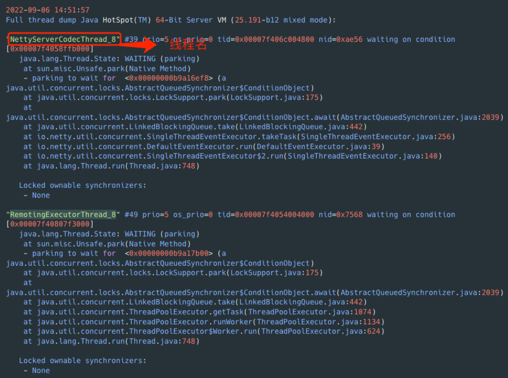

# 问题

## 1、线程池有几个参数?分别有什么作用?


> ThreadPoolExecutor构造函数
>
> | 参数名                   | 作用                                                         |
> | :----------------------- | :----------------------------------------------------------- |
> | corePoolSize             | 队列没满时，线程最大并发数                                   |
> | maximumPoolSizes         | 队列满后线程能够达到的最大并发数                             |
> | keepAliveTime            | 空闲线程过多久被回收的时间限制                               |
> | unit                     | keepAliveTime 的时间单位                                     |
> | workQueue                | 阻塞的队列类型                                               |
> | threadPoolFactory        | 改变线程的名称、线程组、优先级、守护进程状态                 |
> | RejectedExecutionHandler | 超出 maximumPoolSizes + workQueue 时，任务会交给RejectedExecutionHandler来处理 |

## 2、默认的拒绝策略有哪些?

## 3、线程池中的线程数如多达到了核心线程数,那么此时再来一个线程,线程池会如何执行?

## 4、线程池中为什么要存在队列?

## 5、线程池中的线程数量增减流程是?

> 1. 如果 workerCount < corePoolSize，创建并启动一个线程来执行新提交的任务。
> 2. 如果 workerCount >= corePoolSize，且线程池内的阻塞队列未满，则将任务添加到该阻塞队列中。
> 3. 如果 workerCount >= corePoolSize && workerCount < maximumPoolSize，且线程池内的阻塞队列已满，则创建并启动一个线程来执行新提交的任务。
> 4. 如果 workerCount >= maximumPoolSize，并且线程池内的阻塞队列已满, 则根据拒绝策略来处理该任务, 默认的处理方式是直接抛异常。
>
> 
>
> 


# 线程名很重要

**线程名很重要，线程名很重要，线程名很重要** ，重要的事情说三遍。

养成好习惯，一定要设置线程名称。

我们看到 RocketMQ 中，无论是单线程抽象类还是多线程的封装都会配置线程名 ，因为通过线程名，非常容易定位问题，从而大大提升解决问题的效率。

定位的媒介常见有两种：**日志文件**和**堆栈记录**。

**▍一、日志文件**

经常处理业务问题的同学，一定都经常与日志打交道。


- 查看 ERROR 日志，追溯到执行线程， 要是线程池隔离做的好，基本可以判断出哪种业务场景出了问题；
- 通过查看线程打印的日志，推断线程调度是否正常，比如有的定时任务线程打印了开始，没有打印结束，推论当前线程可能已经挂掉或者阻塞。


**▍二、堆栈记录**

jstack 是 java 虚拟机自带的一种堆栈跟踪工具 ，主要用来查看 Java 线程的调用堆栈，线程快照包含当前 java 虚拟机内每一条线程正在执行的方法堆栈的集合，可以用来分析线程问题。

```
jstack -l 进程pid
```



笔者查看线程堆栈，一般关注如下几点：

1. 当前 jvm 进程中的线程数量和线程分类是否在预期的范围内；
2. 系统接口超时或者定时任务停止的异常场景下 ，分析堆栈中是否有锁未释放，或者线程一直等待网络通讯响应；
3. 分析 jvm 进程中哪个线程占用的 CPU 最高。


# Java 全栈知识体系 - Java进阶 - 并发框架

> 著作权归https://pdai.tech所有。
>
> 链接：https://pdai.tech/md/outline/x-outline.html

知识体系系统性梳理


> **B.4 Java进阶 - Java 并发之J.U.C框架【4/5】：线程池**：再者分析JUC中非常常用的线程池等。

- [JUC线程池: FutureTask详解](https://pdai.tech/md/java/thread/java-thread-x-juc-executor-FutureTask.html)
    - FutureTask用来解决什么问题的? 为什么会出现?
    - FutureTask类结构关系怎么样的?
    - FutureTask的线程安全是由什么保证的?
    - FutureTask结果返回机制?
    - FutureTask内部运行状态的转变?
    - FutureTask通常会怎么用? 举例说明。
- [JUC线程池: ThreadPoolExecutor详解](https://pdai.tech/md/java/thread/java-thread-x-juc-executor-ThreadPoolExecutor.html)
    - 为什么要有线程池?
    - Java是实现和管理线程池有哪些方式?  请简单举例如何使用。
    - 为什么很多公司不允许使用Executors去创建线程池? 那么推荐怎么使用呢?
    - ThreadPoolExecutor有哪些核心的配置参数? 请简要说明
    - ThreadPoolExecutor可以创建哪是哪三种线程池呢?
    - 当队列满了并且worker的数量达到maxSize的时候，会怎么样?
    - 说说ThreadPoolExecutor有哪些RejectedExecutionHandler策略? 默认是什么策略?
    - 简要说下线程池的任务执行机制? execute –> addWorker –>runworker (getTask)
    - 线程池中任务是如何提交的?
    - 线程池中任务是如何关闭的?
    - 在配置线程池的时候需要考虑哪些配置因素?
    - 如何监控线程池的状态?
- [JUC线程池: ScheduledThreadPool详解](https://pdai.tech/md/java/thread/java-thread-x-juc-executor-ScheduledThreadPoolExecutor.html)
    - ScheduledThreadPoolExecutor要解决什么样的问题?
    - ScheduledThreadPoolExecutor相比ThreadPoolExecutor有哪些特性?
    - ScheduledThreadPoolExecutor有什么样的数据结构，核心内部类和抽象类?
    - ScheduledThreadPoolExecutor有哪两个关闭策略? 区别是什么?
    - ScheduledThreadPoolExecutor中scheduleAtFixedRate 和 scheduleWithFixedDelay区别是什么?
    - 为什么ThreadPoolExecutor 的调整策略却不适用于 ScheduledThreadPoolExecutor?
    - Executors 提供了几种方法来构造 ScheduledThreadPoolExecutor?
- [JUC线程池: Fork/Join框架详解](https://pdai.tech/md/java/thread/java-thread-x-juc-executor-ForkJoinPool.html)
    - Fork/Join主要用来解决什么样的问题?
    - Fork/Join框架是在哪个JDK版本中引入的?
    - Fork/Join框架主要包含哪三个模块? 模块之间的关系是怎么样的?
    - ForkJoinPool类继承关系?
    - ForkJoinTask抽象类继承关系? 在实际运用中，我们一般都会继承 RecursiveTask 、RecursiveAction 或 CountedCompleter 来实现我们的业务需求，而不会直接继承 ForkJoinTask 类。
    - 整个Fork/Join 框架的执行流程/运行机制是怎么样的?
    - 具体阐述Fork/Join的分治思想和work-stealing 实现方式?
    - 有哪些JDK源码中使用了Fork/Join思想?
    - 如何使用Executors工具类创建ForkJoinPool?
    - 写一个例子: 用ForkJoin方式实现1+2+3+...+100000?
    - Fork/Join在使用时有哪些注意事项? 结合JDK中的斐波那契数列实例具体说明。
