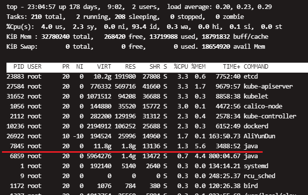
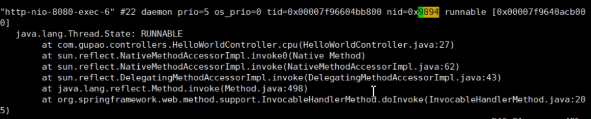
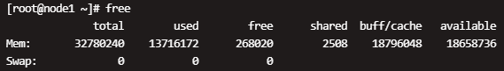
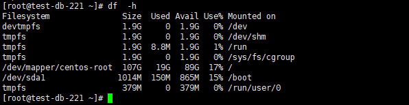
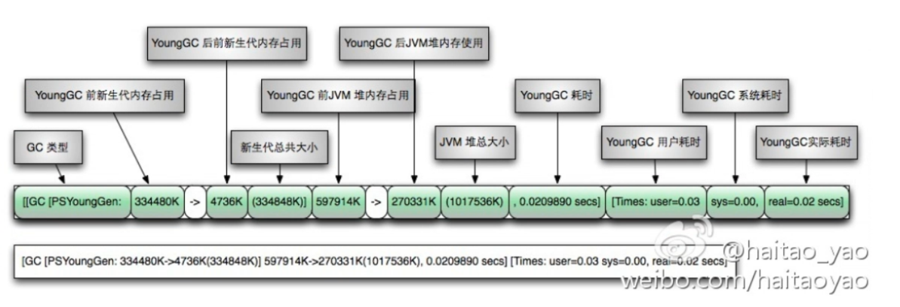
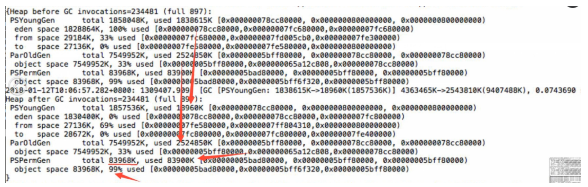

# Java性能优化


# 一、概要：

1、排查源码是否存在耗时操作：例如：递归、序列化等导致cpu负载较高、循环调用磁盘、网络io、数据库慢查询等

2、分析是否存在并发：加锁超时、数据库存在死锁并超时。

3、实现业务的代码，是否合理。比如查询数据是否存在 ，使用 list = select * from xxx ; list.size>0  方式来判断。

> 查询客户标签列表接口，会有个inUsed=true/false字段，标识此标签是否在使用中。原来的实现是如下：（伪代码）
>
> ```java
>  tagVoList.forEach(tagVo - > {
>   list = "select * from [客户-标签-中间表] where tagId =" + tagVo.getId(); 
>   tagVo.setInUsed(list.size() > 0);
>  });  
> ```
>
> 这样判断，会导致大量的查询结果被浪费。修改改方案：
>
> ```java
> list = "SELECT DISTINCT tagId FROM [客户-标签-中间表]";  
> tagVoList.forEach(tagVo -> tagVo.setInUsed(list.contains(tagVo.getId())););   
> ```

4、数据库连接池，是否不够用（有慢查询，导致数据库连接没有及时释放，导致数据库连接池中没有可用的连接。）

> ​	  导出客户列表，存在大量数据库查询，如果单位时间导出次数较多，则会导致数据库连接池中的连接都被占用。此时其他业务需要数据库连接时，池中没有可以的连接，就会等待，直到等待超时，超时后，会报错。


# 二、首先检查 cpu

如果是cpu的问题，那么cpu使用率会提升而不是降低；而CPU 空闲并不一定是没事做，也有可能是锁或者外部资源瓶颈。 

命令 Top：可以查看占用cpu最高的进程。

排查过程：（[jdk自带命令](#http://mp.weixin.qq.com/mp/homepage?__biz=MzI3NzE0NjcwMg==&hid=1&sn=5d29d6730a7e59de9f0e0e14f7e8d72b)）

1、使用top命令，查看是否是java进程cpu负载最高。记住`pid`的值 



2、查看java进程中所有线程运行状态：`jstack <pid> > tmp.txt`

3、把`pid`转成十六进制：`printf "%x" <pid>`
4、在tmp.txt文件中查找十六进制数字：`cat a.txt | grep printf '%x' <pid>`



上图：`RUNNALBE`是运行状态；程序运行到了HelloWorldContorller.cpu方法的27行，那么这里可能就是问题所在。

5、备注：top命令默认是进程模式，使用如下命令查看进程的各个线程运行情况：

```
top -Hp pid
```

 

# 三、内存

1．使用`free`命令查看服务器内存情况:



2．使用以下命令查看java进程内存：

（1）[jmap -heap pid](#https://docs.oracle.com/javase/8/docs/technotes/guides/troubleshoot/tooldescr014.html) 查看堆使用情况

（2）[jstat -gcutil pid 1000 7](#https://docs.oracle.com/javase/8/docs/technotes/guides/troubleshoot/tooldescr017.html) 每一秒打印一次gc情况,总打印7次

（3）[jstack pid](#https://docs.oracle.com/javase/8/docs/technotes/guides/troubleshoot/tooldescr016.html) 打印线程栈运行情况

3.MAT：eclipse插件。[下载](http://help.eclipse.org/oxygen/index.jsp?topic=/org.eclipse.mat.ui.help/welcome.html)

	需要在java启动命令上，添加如下参数。表示：当oom时，把堆内存dump出来，保存到指定的文件中。
	
	-XX:+HeapDumpOnOutOfMemoryError 
	
	-XX:HeapDumpPath=/home/administrator/james/error.hprof

常用的项目启动参数： [k8s容器启动参数.md](k8s容器启动参数.md) 


# 四、Io



# 五、如何查看gc

1．首先，要确定使用的哪种gc收集器

	-XX:+PrintFlagsFinal
	
	-XX:+PrintCommandLineFlags
	
	server client
	
	MBean

2．打印gc日志：

		-XX:+PrintGCTimeStamps 	//打印gc时间戳（单行显示）
	
		-XX:+PrintGCDetails  //打印gc详细信息日志（多行显示）
	
		-Xloggc:/home/administrator/james/gc.log 	//gc日志保存地址
	
		-XX:+PrintHeapAtGC 		//当gc时，打印堆信息
	
		-XX:-UseGCLogFileRotation 	//使用gc日志文件分割
	
		-XX:GCLogFileSize=8K 	//gc日志文件分隔大小

3．gc日志使用`tail -f gc.log`查看

4．gc日志格式：



(1) gc类型：新生代(Minor)GC+老年代(Major)GC = Full GC

(2) gc前内存大小 -> gc后内存大小 (总内存大小) 

堆gc前内存大小 -> 堆gc后内存大小（堆总内存大小）

(3) gc耗时、gc用户态耗时、内核态耗时、实际耗时

(4) 说明：如果是Full GC，则一行gc日志中会包含 新生代gc和老年代gc；如果是java8jvm，则还会包含Metaspace gc日志（注意：Metaspace是对外内存）

2、gc对cpu负载的影响：

(1) Parallel Scavenge(并行全局)GC：关注的是吞吐量（执行gc时，垃圾清理的很干净，但gc停顿时间较长）对cpu负载压力不大。

(2) CMS GC收集器：目的为了减少gc停顿时间。当堆内存用尽时，会使用一个线程不断的去gc，是cpu敏感的垃圾收集器。所以对于cpu运用较高，cpu负载压力较大。使用top命令查看java进程%CPU约等于100%（可以看到cms使用一个线程做垃圾收集、cpu敏感）

3、案例分析：


1、看到发生的gc包含年轻代、老年代、持久代：则说明是java1.7  Full GC

2、gc发生后，eden使用率从100%变为0%；from从33%变为69%

3、Old区，使用率保持33%：说明old区对象未被回收。（如果old不持续正常，则问题不大，如果持续增长且gc时无法回收，则说明存在内存泄漏。）

4、Perm区，使用率保持99%：说明了此gc是由持久代内存不够发生的Full GC

5、解决方案：适当加大perm区内存大小。可能是jsp/动态代理类过多导致。

六、给运维人员的简单步骤  [原文链接](https://mp.weixin.qq.com/s/vp2kA6hY_9qO8iqnS-dHYQ)

如果事发突然且不能留着现场太久，要求运维人员： 

1. top: 记录cpu idle%。如果发现cpu占用过高，则c, shift+h, shift + p查看线程占用CPU情况，并记录

2. free: 查看内存情况，如果剩余量较小，则top中shift+m查看内存占用情况，并记录

3. 如果top中发现占用资源较多的进程名称（例如java这样的通用名称）不太能说明进程身份，则要用ps xuf | grep java等方式记录下具体进程的身份 

4. 取jstack结果。假如取不到，尝试加/F

```
 jstack命令：jstack PID > jstack.log
```

5. jstat -heap pid查看OLD区占用率。如果占用率到达或接近100%，则jmap取结果。假如取不到，尝试加/F

  jstat命令： jstat -gcutil PID

```
S0  S1   E    O   P   YGC   YGCT   FGC  FGCT  GCT
0.00 21.35 88.01 97.35 59.89 111461 1904.894 1458 291.369 2196.263
```

jmap dump堆内存命令：

```
jmap -dump:file=dump.map PID
```

6. 重启服务


