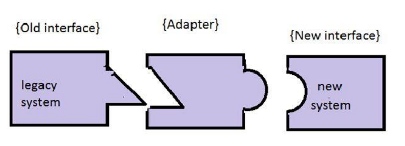
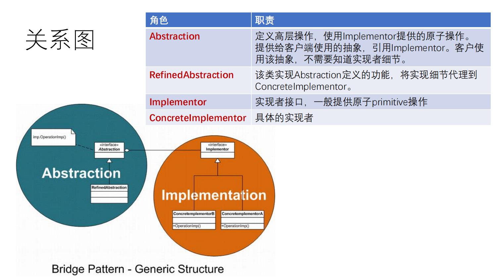
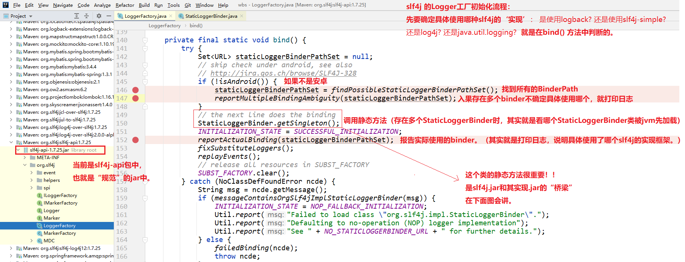
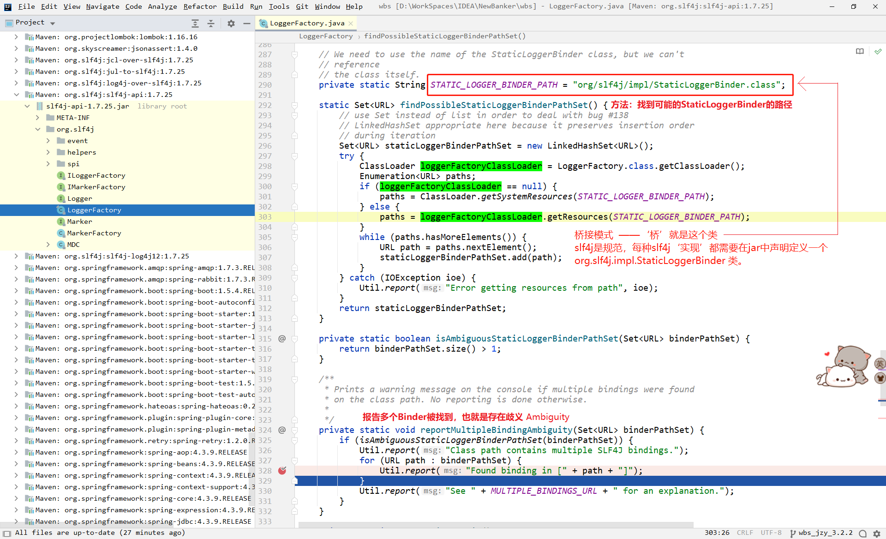
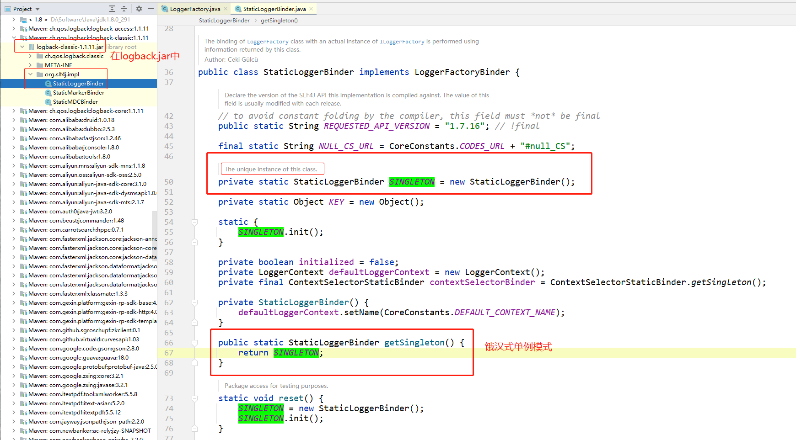
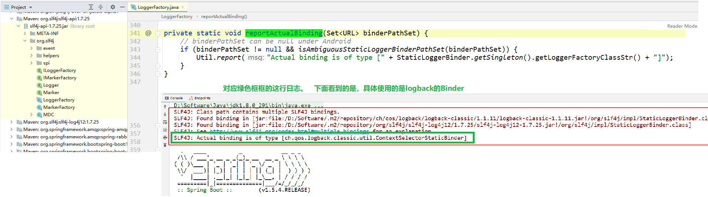

在项目启动时，经常会遇到如下警告：

```
SLF4J: Class path contains multiple SLF4J bindings.
SLF4J: Found binding in [jar:file:/D:/Software/.m2/repository/ch/qos/logback/logback-classic/1.1.11/logback-classic-1.1.11.jar!/org/slf4j/impl/StaticLoggerBinder.class]
SLF4J: Found binding in [jar:file:/D:/Software/.m2/repository/org/slf4j/slf4j-log4j12/1.7.25/slf4j-log4j12-1.7.25.jar!/org/slf4j/impl/StaticLoggerBinder.class]
SLF4J: See http://www.slf4j.org/codes.html#multiple_bindings for an explanation.
SLF4J: Actual binding is of type [ch.qos.logback.classic.util.ContextSelectorStaticBinder]
```


# 解决方案 + 原因讲解

[【java】20分钟搞清log4j/logback/log4j2/slf4j || 如何统一日志标准](https://www.bilibili.com/video/BV11J411d7Gp)

[上面视频配套的github文档](https://github.com/sunwu51/notebook/blob/master/19.11/log_java%E6%97%A5%E5%BF%97%E6%A1%86%E6%9E%B6.md)

 图片来源：http://www.slf4j.org/images/concrete-bindings.png


# slf4j 设计模式

1、`门面模式`、`适配器模式`。详见：[【java】slf4j中的适配器与桥接是怎样工作的？](https://www.bilibili.com/video/BV1FJ411R78C)

2、问题：为什么`log4j-over-slf4j`重写`log4j`中所有类，就能在项目中使用`log4j`和`slf4j`中的类呢？

- 这个里面使用的是迷惑战术，这样系统中使用log4j的类，编译时不会报错，但是重写后的这些类内部实现时，却将日志悄悄代理到了SLF4J相关接口。

- 能使用`log4j`的的原因视频中已经讲了：类加载时，加载了重写的类名，log4j中的同名类，就不会被加载了。在重写的方法中，全部委托给`slf4j`来处理日志。`slf4j`底层可以绑定到新项目下的`logback`。
- 能用`slf4j`：因为`log4j-over-slf4j`依赖了`slf4j`，所以项目中也能使用`slf4j`的类。
- [在github文档上也能详解了这个问题](https://github.com/sunwu51/notebook/blob/master/19.11/log_java%E6%97%A5%E5%BF%97%E6%A1%86%E6%9E%B6.md#%E5%8E%9F%E7%90%86)

3、`log4j-over-slf4j`适配器模式。

> 画外音：
>
> 上面   [【java】slf4j中的适配器与桥接是怎样工作的？](https://www.bilibili.com/video/BV1FJ411R78C)    视频中06:43讲解的`log4j-over-slf4j`使用了`桥接模式`，我个人理解是使用的是`适配器模式`。[适配器模式](https://gitee.com/anxiaole/spring-framework/tree/5.0.x/core-spring-patterns#2-%E7%BB%93%E6%9E%84%E6%A8%A1%E5%BC%8F)
>
> 简单说说个人这样理解的思路：
>
> 个人感觉`slf4j`和`log4j`虽然都是日志，但是他俩本身`不兼容`。那为了能让两个不兼容的东西，在一起愉快的玩耍，所以他俩中间有个适配器，适配器去兼容两方：
>
> 
>
> 而`桥接模式`中只有两个角色：一个是`抽象`、一个是`实现`。*（`抽象`就相当于本篇的说的`规范`）*
>
> 使用桥接模式，可以**将抽象和实现解耦，让两边能独立变化**。适用于跨平台支持、插件、驱动程序driver等。
>
> 
>
> 结合上面的关系图，我们分析一下slf4j：
>
> - slf4j-api 是抽象层。用户在使用抽象层的API时，无需关注具体的实现是什么。
> - logback / log4j / java.util.logging / slf4j-simple 这些都是`实现`。而且可以随意选择使用哪种`实现`。只要`实现`符合`抽象`的要求，`实现`层可以随意优化/升级。
>
> 综上，我个人理解为：`log4j-over-slf4j`使用的是`适配器模式`。

4、桥接模式。详见下面。


# 桥接模式-绑定

`slf4j`是`门面`，是规范。`logback`是实现。

虽然logback中的 `ch.qos.logback.classic.Logger` 直接实现了 `org.slf4j.Logger`。但是slf4j并没有和logback强绑定。我们开发这也并没有通过配置文件或其他任何配置方式来指定使用哪种实现。

**`slf4j`使用的`桥接模式`，`规范`和`实现`之间是如何进行绑定到一起的呢？**

*（下图：slf4j绑定的主流程）*



桥接模式 —— `slf4j`规范和其实现的’桥‘，就是  `org.slf4j.impl.StaticLoggerBinder`类。

slf4j规范中规定了：每种`slf4j实现`都需要在jar中定义一个  `org.slf4j.impl.StaticLoggerBinder`类，

slf4j在`初始化`时：

- 会调用 `org.slf4j.LoggerFactory#findPossibleStaticLoggerBinderPathSet`，使用类加载器找到classpath中所有的 `org/slf4j/impl/StaticLoggerBinder.class` 文件。

- 如果存在多个 `org/slf4j/impl/StaticLoggerBinder.class` 文件在classpath中被找到，就打印 ：

  ```
  SLF4J: Class path contains multiple SLF4J bindings.
  SLF4J: Found binding in [jar:file:/D:/Software/.m2/repository/ch/qos/logback/logback-classic/1.1.11/logback-classic-1.1.11.jar!/org/slf4j/impl/StaticLoggerBinder.class]
  SLF4J: Found binding in [jar:file:/D:/Software/.m2/repository/org/slf4j/slf4j-log4j12/1.7.25/slf4j-log4j12-1.7.25.jar!/org/slf4j/impl/StaticLoggerBinder.class]
  SLF4J: See http://www.slf4j.org/codes.html#multiple_bindings for an explanation.
  // 这里注意：在项目中实际选用了哪个slf4j实现，在此并没有打印。而是在 reportActualBinding(staticLoggerBinderPathSet); 方法中打印的。
  ```

*（下图：找到classpath中所有的`org/slf4j/impl/StaticLoggerBinder.class`）*




**如果存在多个`slf4j`实现，具体选择哪个呢？就是下面这句话：**

```java
// the next line does the binding 下面这一样，执行绑定逻辑。
StaticLoggerBinder.getSingleton();
```

在第一张图中我们说了，此静态方法就是`slf4j`和`具体实现`之间的桥梁。

> 画外音：【桥接模式】这里简单说一下桥接模式的好处：
>
> 【API的使用方，无需关注复杂的实现逻辑，只需要根据规范的步骤来使用API就行了。】
>
> 说人话：程序员在使用slf4j时，无需关注底层具体实现，也无需配置使用哪种实现，只需要使用对应的API就完了。
>
> 回想一下：使用日志框架，我们只配置过日志输出等级、输出格式等，并没有配置`slf4j`使用的哪种实现。只需要在maven引入对应的依赖。使用`logback`就在maven中引入`logback`的依赖；使用`log4j`就引入`log4j`的依赖就行了。
>
> *另外：[jdbc的java.sql.DriverManager 也是使用的桥接模式](https://www.cnblogs.com/yougewe/p/12460685.html)。*



你可能会说：等等，单例模式已经理解了，但是还是没有说明：**如果存在多个`slf4j`实现时，具体选择哪个呢？**这个选择过程呢！？选择过程！！并没有看到啊！！

解答：其实这个选择过程是jvm类加载帮我们做的：我们上面说了：在每个`slf4j`的实现框架中，比如`logback.jar`或`slf4j-log4j12.jar`，都需要定义一个`org.slf4j.impl.StaticLoggerBinder`类。注意这里的 `类名及包名` 都是一样的：也就是两个jar包中都有  `org.slf4j.impl.StaticLoggerBinder`类，那jvm在类加载时，加载完第一个jar包中的类后，第二个jar包中的同名类，就不会加载了。正是使用类加载的这个机制，来实现的`选择`过程。


**绑定完-日志输出实际使用的Binder**

```java
reportActualBinding(staticLoggerBinderPathSet);
```



到这里`slf4j`的初始化就完事了，在之后，使用`slf4j`时，具体日志实现是`logback`。


# 其他资料

[slf4j&logback源码解析：从源码中我们能学到什么](https://www.bilibili.com/video/BV1KD4y197Jf)

