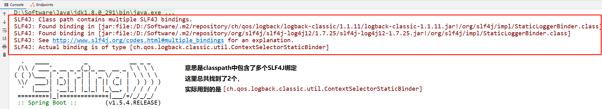

在项目启动时，经常会遇到如下警告：

```
SLF4J: Class path contains multiple SLF4J bindings.
SLF4J: Found binding in [jar:file:/D:/Software/.m2/repository/ch/qos/logback/logback-classic/1.1.11/logback-classic-1.1.11.jar!/org/slf4j/impl/StaticLoggerBinder.class]
SLF4J: Found binding in [jar:file:/D:/Software/.m2/repository/org/slf4j/slf4j-log4j12/1.7.25/slf4j-log4j12-1.7.25.jar!/org/slf4j/impl/StaticLoggerBinder.class]
SLF4J: See http://www.slf4j.org/codes.html#multiple_bindings for an explanation.
SLF4J: Actual binding is of type [ch.qos.logback.classic.util.ContextSelectorStaticBinder]
```




# 解决方案 + 原因讲解：

[【java】20分钟搞清log4j/logback/log4j2/slf4j || 如何统一日志标准](https://www.bilibili.com/video/BV11J411d7Gp)

[上面视频配套的github文档](https://github.com/sunwu51/notebook/blob/master/19.11/log_java%E6%97%A5%E5%BF%97%E6%A1%86%E6%9E%B6.md)


# 其他资料

[【java】slf4j中的适配器与桥接是怎样工作的？](https://www.bilibili.com/video/BV1FJ411R78C)

[slf4j&logback源码解析：从源码中我们能学到什么](https://www.bilibili.com/video/BV1KD4y197Jf)

