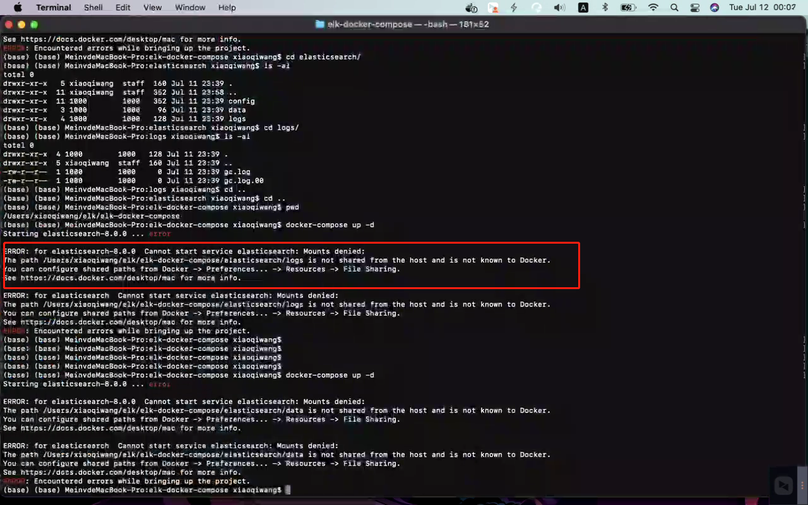

# 安装docker

https://gitee.com/starsky20/docker-compose-application#docker%E5%AE%89%E8%A3%85


# 安装组件

## [elk](https://gitee.com/daitougege/elk-docker-compose)

- 使用这个方式安装mac会报错：

  需要把需要挂载的这个路径配置到docker控制台中：

- [Kibana常用命令](https://blog.csdn.net/yuntianyun/article/details/114187301)
- [ELK可视化管理工具之：kibana常用操作命令](https://dandelioncloud.cn/article/details/1486718450675601409)
- [ES官方文档：使用docker-compose启动一个多节点集群](https://www.elastic.co/guide/en/elasticsearch/reference/current/docker.html#docker-compose-file)

## [docker-compose-redis](https://gitee.com/usual-docker-compose/docker-compose-redis)
##  [Redis各种版本俱全](https://gitee.com/starsky20/docker-compose-application#redis)

## [mysql](https://gitee.com/starsky20/docker-compose-application#mysql)

## [mongodb](https://gitee.com/starsky20/docker-compose-application#mongodb) 

## [RabbitMQ](https://gitee.com/starsky20/docker-compose-application#rabbitmq)

## [Nacos](https://gitee.com/starsky20/docker-compose-application#nacos)

## [Nginx](https://gitee.com/starsky20/docker-compose-application#nginx)


# 常见问题

## [docker内apt-get install提示权限不足](https://blog.csdn.net/weixin_43848469/article/details/124453889)

## [解决docker下载安装速度慢的问题](https://www.jb51.net/article/206785.htm)

> ```bash
> 查看是否设置成功：   docker info
> ```
>
> 

## [Windows10子系统ubuntu如何重启](https://www.yisu.com/zixun/599912.html)

> net stop LxssManager
> net start LxssManager
>
> 然后需要重启docker 控制台