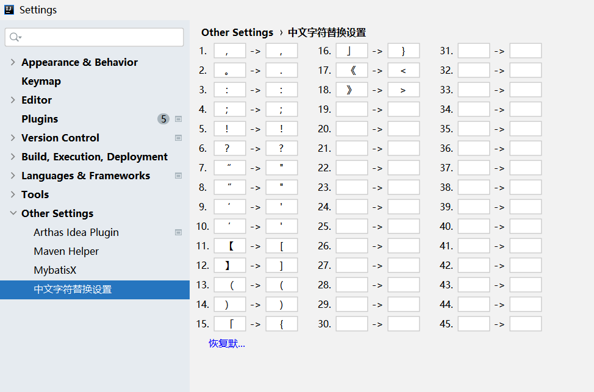

# 程序员你为什么这么累

**这个版块来源于知乎的一篇文章：https://zhuanlan.zhihu.com/p/28705206**

这篇文章我很久以前就看过，但是很少分享关于【开发效率】相关的东西。可能我是觉得这是每个开发工程师个人的自由吧。

但是对于我个人来说，自我感觉我是一个很懒的人：如果同一件事让我费了三次功夫，我就会想：如何才能去优化这个过程呢？

- 比如多次有人问我配置中心该如何配置，我就写了个文档，后续在来人询问，直接把文档连接发过去，完事。

- 比如在使用Charles抓包过程中，经常需要把URLEncoding的字符串，复制到网页Decoding一下，这就很烦。所以按照网上的教程，我把Charles反编译，然后给添加了 URLDecoding 功能。这就很爽。

  

# 让bug扼杀在摇篮中

偶尔也会看一下小tips，这对面试基本没啥用。

但在开发过程注意到之后，开发质量就有所提高，相应的bug就少；而且在排查问题时也能快速的定位到bug具体位置。

#### [工作四年，分享50个让你代码更好的小建议](https://mp.weixin.qq.com/s/GLRtkP-Jrv3yCaVfqET6dw)

# IDEA使用技巧

#### [收藏！这些IDE使用技巧，你都知道吗](https://mp.weixin.qq.com/s/Vpyugl5FtwKHTon-EuO8zQ)

# idea插件

> 下面几个插件，是我在idea中经常使用的。并且可以大大提高开发效率

## 中文字符替换工具

自动替换中文逗号、分号、句号、引号等字符，延迟程序员狂躁症发作，延长退格键使用时间。

主要功效： 1.自动替换中文的逗号、分号、句号、括号等代码常用字符; 2.程序员狂躁症的发作次数明显减少; 3.键盘寿命明显增加; 4.代码bug明显减少; 5.编码效率提升百分之好几十; 6.产品经理终于可以下床了！

主页：https://plugins.jetbrains.com/plugin/13867-----

## [Maven Helper 依赖插件](https://blog.csdn.net/wangmx1993328/article/details/85244208)

1、Maven Helper 是一个将 maven 依赖树可视化的插件，可以方便的查看依赖以及处理依赖冲突问题(比原生的要好用的多)。

2、安装：File > Settings > Plugins > Marketplace > Search for "Maven Helper" > Install Plugin > Restart IntelliJ IDEA

3、conflicts：表示冲突，选中之后，下面左侧框会显示冲突的依赖，右侧框显示具体冲突的依赖，右侧选中某项右击可以排除依赖，解决冲突。

## [Key promoter插件——快捷键显示提示](https://blog.csdn.net/wangmx1993328/article/details/85244208)

个人来讲，我比较喜欢在开发过程中使用快捷键。因为不需要把手一动到鼠标上。使用这个插件后，当使用鼠标点击idea上的功能时，这个插件会自动提示是否设置快捷键。

[点击](https://blog.csdn.net/qq_36838191/article/details/123787683)

## [下划线、驼峰及大小写转换插件 CamelCase](https://blog.csdn.net/wangmx1993328/article/details/85244208)

1、idea 自带快捷键 CTRL+SHIFT+U 进行大小写的转换，而有时候我们还需要在大小写转换的同时，还支持驼峰与下划线的转换，此时可以借助 CamelCase 插件。

2、Settings -> Plugins -> 然后输入 CamelCase 关键字搜索 -> 对目标插件点击 "Install" 按钮安装 -> 安装完成后重启 IDEA 生效

3、安装 CamelCase 插件之后，可以使用快捷键 SHIFT+ALT+U，选中目标单词，按 u 就会变，直到变成想要的即可。

4、显然默认的快捷键 SHIFT+ALT+U 需要两只手才能操作，有时候不是很方便，所以可以修改它。

## [翻译插件 **Translation**](https://blog.csdn.net/wangmx1993328/article/details/85244208)

1、非常好用的翻译插件，功能很强大，界面很漂亮，插件地址:[Translation - IntelliJ IDEs Plugin | Marketplace](https://plugins.jetbrains.com/plugin/8579-translation)

2、插件安装与 p3c 一样：

## [RestfulToolkit http 插件](https://blog.csdn.net/wangmx1993328/article/details/85244208)

1、插件官网地址：[RestfulToolkit - IntelliJ IDEs Plugin | Marketplace](http://plugins.jetbrains.com/plugin/10292-restfultoolkit)

2、直接在线安装：settings -> plugins -> Marketplace，输入 "restfultoolkit" 搜索，然后安装重启生效。

3、安装完成后会有一个 RestServies 窗口，可以依次 Views -> Tool Windows -> RestServies 打开。RestServies 窗口中提供了整个应用下所有的 http 请求地址。

4、同时 restfultoolkit 插件提供了发送 http 请求的功能，可以直接从 RestServies 窗口中发送各种 rest 风格的请求，而不需要再从浏览器发起。

5、使用快捷键 Ctrl + \ 或者 Ctrl Alt N 可以通过搜索 url 地址然后直接跳转到对应的方法定义 ，这在接手新项目时特别有用。

6、格式化 json 数据 ( Windows: Ctrl + Enter; Mac: Command + Enter )

