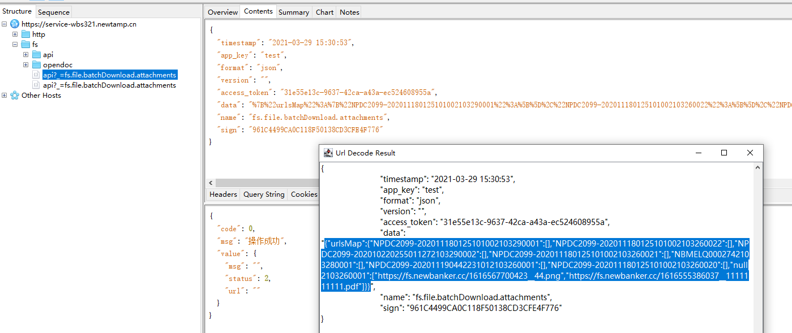

# 程序员你为什么这么累

**这个版块来源于知乎的一篇文章：https://zhuanlan.zhihu.com/p/28705206**

这篇文章我很久以前就看过，但是很少分享关于【开发效率】相关的东西。可能我是觉得这是每个开发工程师个人的自由吧。

但是对于我个人来说，自我感觉我是一个很懒的人：如果同一件事让我费了三次功夫，我就会想：如何才能去优化这个过程呢？

- 比如多次有人问我配置中心该如何配置，我就写了个文档，后续在来人询问，直接把文档连接发过去，完事。

- 比如在使用Charles抓包过程中，经常需要把URLEncoding的字符串，复制到网页Decoding一下，这就很烦。所以按照网上的教程，我把Charles反编译，然后给添加了 URLDecoding 功能。这就很爽。

  

# 让bug扼杀在摇篮中

偶尔也会看一下小tips，这对面试基本没啥用。

但在开发过程注意到之后，开发质量就有所提高，相应的bug就少；而且在排查问题时也能快速的定位到bug具体位置。

## [工作四年，分享50个让你代码更好的小建议](https://mp.weixin.qq.com/s/GLRtkP-Jrv3yCaVfqET6dw)

# 快捷键

个人来讲，我比较喜欢在开发过程中使用快捷键。因为不需要把手一动到鼠标上。所以我把IDEA的快捷键设置导出成setting.jar配置文件，每次都上传到百度云盘，这配置丢了之后，我开发肯定非常难受。

