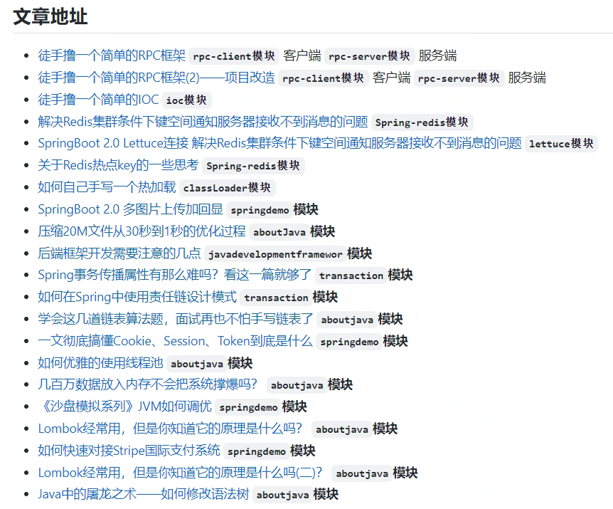

# [芋道源码](https://www.iocoder.cn/)

# TJ君-开源项目与工具

TJ君会根据GitHub精选、效率软件、精美壁纸等不同分类，将有用及有趣的开源项目及各种工具推荐给大家，同时也欢迎各位小伙伴通过 Pull Request 或者 issues 给TJ君留言推荐各种你觉得有用或好玩的项目，TJ君一定会持续更新，fighting~

https://github.com/Wechat-TJ/TJ-WORLD-FORU

# [Supporting Doraemon](https://github.com/modouxiansheng/Doraemon)

> 对于一些后端常用框架的深入理解
>
> 

# [IT_book](https://github.com/XiangLinPro/IT_book)

> 本项目收藏这些年来看过或者听过的一些不错的常用的上千本书籍，没准你想找的书就在这里呢，包含了互联网行业大多数书籍和面试经验题目等等。有人工智能系列（常用深度学习框架TensorFlow、pytorch、keras。NLP、机器学习，深度学习等等），大数据系列(Spark,Hadoop,Scala,kafka等)，程序员必修系列（C、C++、java、数据结构、linux，设计模式、数据库等等）