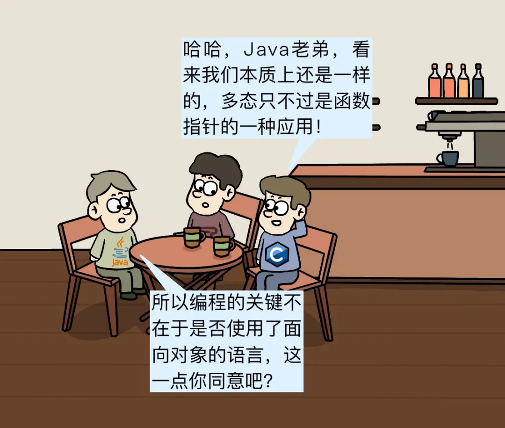

> 转自：https://mp.weixin.qq.com/s/ohDpo3oIiok7GtmvjVf1Ng
>
> 原创 码农翻身刘欣 [码农翻身](javascript:void(0);) *2021-11-24 09:03*

又是周末，编程语言“三巨头”**Java**, **Lisp** 和**C**语言照例在Hello World咖啡馆聚会。

对于三位老顾客，服务员总是殷勤接待

（码农翻身注：这是一篇很早之前的文章，作者是大名鼎鼎的Joe Armstrong ， 也就是Erlang之父。）

原来这是Erlang之父Joe Armstrong写的一篇“战斗檄文”，里边充满了对面向对象的批判。

Java看到C语言这么顽冥不化，决定上代码，给他点儿颜色瞧瞧。

没想到C语言不甘示弱，也把代码搬了出来

Java无语，心说这两个家伙就是胡搅蛮缠。

突然，他心中一动：我怎么忘记**多态**了！

Java看到C语言已经入套，从口袋里拿出一幅图，准备给他最后一锤。

C 语言沉默了，他还想反击，但一直找不到突破口。

（码农翻身注：C语言实现面向对象的详情可以移步《[C语言：春节回家，就我没有对象！](http://mp.weixin.qq.com/s?__biz=MzAxOTc0NzExNg==&mid=2665515676&idx=1&sn=f533f8b990463a69504c43d659b04214&chksm=80d672dfb7a1fbc9070d6f9cc24589942ef93fd9ad94d99d25a3d6bbb9467c657f85eccb5558&scene=21#wechat_redirect)》）

Java没想到支持函数式编程的Lisp居然给自己出了一道面向对象的题，大为惊讶。

他稍一思考，就在白板上花了一幅图。

Lisp看到Java 掉入了陷阱，心中不由一乐。

Java 低头沉思不语，突然，脑海中想起来了那句话：优先使用组合而不是继承。

怎么使用组合？必须得改变下看待问题的方式，对，应该这样：

（完）