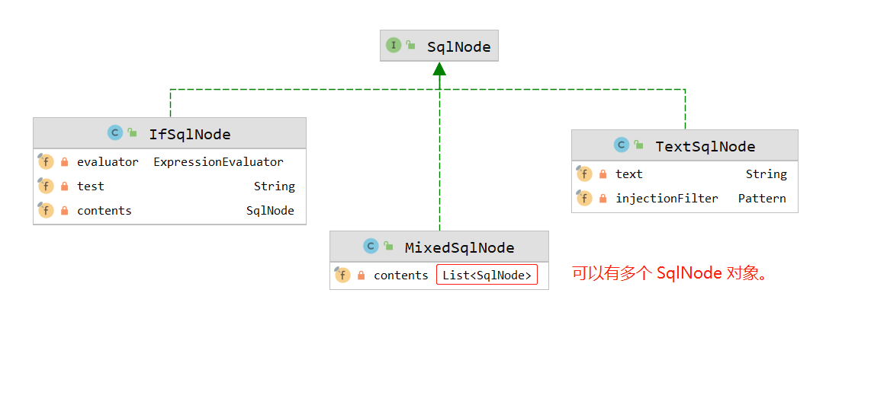
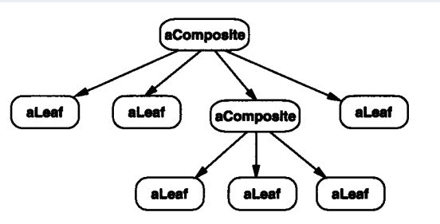
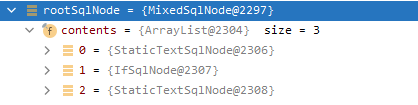
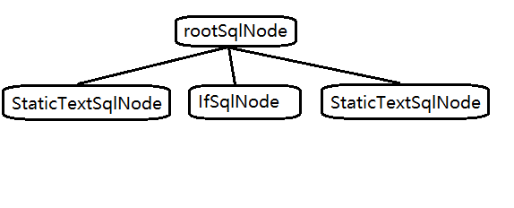
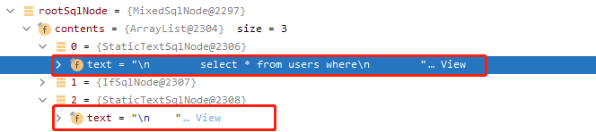
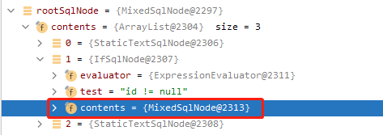
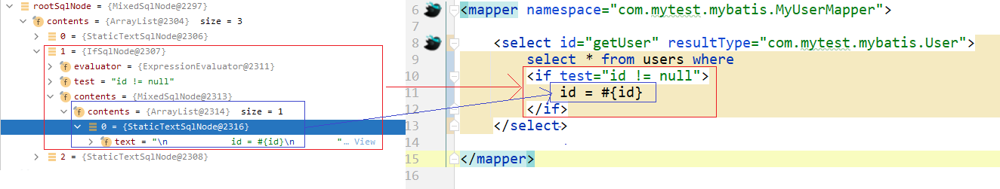

# 前言

在 [装饰模式和组合模式.md](装饰模式和组合模式.md) 一文中,描述过组合模式在mybatis中有使用，也就是：`org.apache.ibatis.scripting.xmltags.MixedSqlNode`。

那本篇文章，就仔细研究研究 MixedSqlNode。


# 类结构



如果把组合模式看做一棵树，

`IfSqlNode`、`TextSqlNode`就是叶子节点。

`MixedSqlNode` 就是枝干节点。枝干节点中，可以包含多个叶子节点。


# Mapper.xml

```xml
<select id="getUser" resultType="com.mytest.mybatis.User">
    select * from users where
    <if test="id != null">
        id = #{id}
    </if>
</select>
```

如上这个简单的查询语句，如果要你自己解析成java对象，你应该如何设计呢？

结合上面，把xml各个节点比作一棵树，来思考几分钟再往下看。


# MixedSqlNode

Mybatis中，把这些动态SQL，定义了一个实体—— `SqlNode`，SQL节点

具体的节点包含 `文本text节点`、`if节点`、`foreach节点`、`where节点`等等。

还有 `MixedSqlNode` 混合节点，混合节点中可以包含任意类型的节点：

```java
public class MixedSqlNode implements SqlNode {
    
  List<SqlNode> contents;

  public MixedSqlNode(List<SqlNode> contents) {
    this.contents = contents;
  }
}  
```

这个时候，对比上面代码再看这个树状图，是不是有内味儿了？




# debug查看数据结构

我们使用一下动态sql，debug一下，看一下具体SQLNode数据：

```xml
<select id="getUser" resultType="com.mytest.mybatis.User">
    select * from users where
    <if test="id != null">
        id = #{id}
    </if>
</select>
```

首先看第一层级：



根节点 rootSqlNode 是 `MixedSqlNode` 类型，其中的 contents 有3个元素，也就是：



下标为0和下标为2的`StaticTextSqlNode`都比较好理解：

- 第一个表示：select * from users where\n
- 第二个表示 \n
- 


下标为1的IfSqlNode:



IfSqlNode中有三个元素：

```
private final ExpressionEvaluator evaluator;
private final String test;
// 表示if标签中的元素，一般都是 MixedSqlNode
private final SqlNode contents;
```





