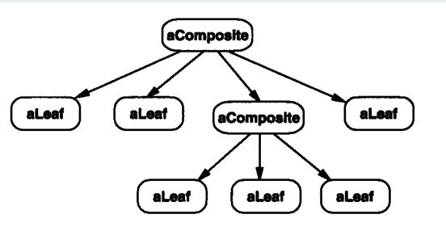

# 装饰者模式和组合模式的区别？

## 组合模式

### UML图

### 树形结构图

### 应用

- org.apache.ibatis.scripting.xmltags.SqlNode
  - org.apache.ibatis.scripting.xmltags.MixedSqlNode 就是`Composite`角色
  - SqlNode 的其他实现类都是`Leaf`角色

## 装饰者模式

### 应用

- org.apache.ibatis.cache.Cache   MyBatis缓存接口
- org.apache.ibatis.executor.CachingExecutor    MyBatis二级缓存执行器

# 区别

1. 组合模式类似树形结构，装饰模式类似串形结构
2. 组合模式一个组件可以包含多个子组件，装饰模式一个装饰组件只能包含一个组件

# 参考

# https://segmentfault.com/a/1190000020938633

# 疑问

- 装饰模式和静态代理模式有什么区别？