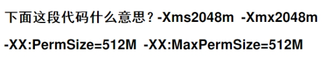
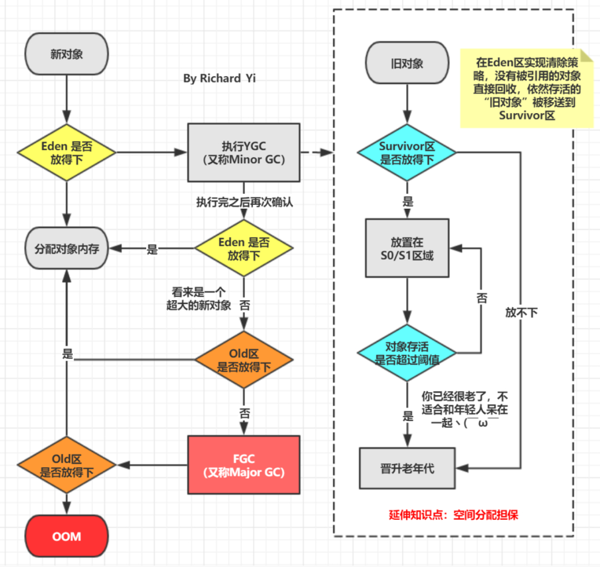

 

# MySQL


## 分页：每页10条数据，查询第2页，limit 后面两个参数如何写？

limit 10,10


## 如何确定一条已知sql语句是慢查询呢？

explain

## 什么样的字段适合创建索引？

1、表的主键、外键必须有索引； 
2、数据量超过300的表应该有索引； 
3、经常与其他表进行连接的表，在连接字段上应该建立索引； 
4、经常出现在Where子句中的字段，特别是大表的字段，应该建立索引； 
5、索引应该建在选择性高的字段上； 
6、索引应该建在小字段上，对于大的文本字段甚至超长字段，不要建索引； 
7、复合索引的建立需要进行仔细分析；尽量考虑用单字段索引代替：

> A、正确选择复合索引中的主列字段，一般是选择性较好的字段；
>
> B、复合索引的几个字段是否经常同时以AND方式出现在Where子句中？单字段查询是否极少甚至没有？如果是，则可以建立复合索引；否则考虑单字段索引；
>
> C、如果复合索引中包含的字段经常单独出现在Where子句中，则分解为多个单字段索引；
>
> E、如果既有单字段索引，又有这几个字段上的复合索引，一般可以删除复合索引；

8、频繁进行数据操作的表，不要建立太多的索引； 
9、删除无用的索引，避免对执行计划造成负面影响；


## select语句中，哪些操作会使索引失效？

(放弃使用索引而进行全表扫描的几种情形 )

\1. 首先应考虑在 where 及 order by 涉及的列上建立索引。 

\2. 应尽量避免在 where 子句中使用 != 或 <> 操作符

\3. 应尽量避免在 where 子句中对字段进行 null 值判断。建议把字段设置为非空，并且设置默认值.

\4. 应尽量避免在 where 子句中使用 or 来连接条件

> 使用or，又想索引生效，只能将or条件中的每个列都加上索引

\5. 模糊查询不能前置百分号——like条件将放弃使用索引

\6. in 和 not in 也要慎用，否则会导致全表扫描.

> 对于连续的数值，能用 between 就不要用 in 

\8. 不要在 where 子句中的“=”左边进行函数、算术运算或其他表达式运算

\9. 数据类型的转换:当查询条件存在隐式转换时，索引会失效。

\10. 尽量避免向客户端返回大数据量，若数据量过大，应该考虑相应需求是否合理。 

\11. 尽量避免大事务操作，提高系统并发能力。


## 什么是覆盖索引和回表？

覆盖索引指的是在一次查询中，如果一个索引包含或者说覆盖所有需要查询的字段的值，我们就称之为覆盖索引，而不再需要回表查询。

而要确定一个查询是否是覆盖索引，我们只需要explain sql语句看Extra的结果是否是“Using index”即可。

以上面的user表来举例，我们再增加一个name字段，然后做一些查询试试。

explain select * from user where age=1; //查询的name无法从索引数据获取 explain select id,age from user where age=1; //可以直接从索引获取


## 使用sql语句如何开启事务？提交事务？回滚事务？

begin;    或者  set autocommit=0    或者   start transaction;

commit;

rollback;


## 说说事务的基本特性和隔离级别吗？

事务基本特性ACID分别是：

- 原子性指的是一个事务中的操作要么全部成功，要么全部失败。

- 一致性指的是数据库总是从一个一致性的状态转换到另外一个一致性的状态。比如A转账给B100块钱，假设中间sql执行过程中系统崩溃A也不会损失100块，因为事务没有提交，修改也就不会保存到数据库。

- 隔离性指的是一个事务的修改在最终提交前，对其他事务是不可见的。

- 持久性指的是一旦事务提交，所做的修改就会永久保存到数据库中。

而隔离性有4个隔离级别，分别是：

- read uncommit 读未提交，可能会读到其他事务未提交的数据，也叫做脏读。

- read commit 读已提交，两次读取结果不一致，叫做不可重复读。不可重复读解决了脏读的问题，他只会读取已经提交的事务。

- repeatable read 可重复复读，这是mysql的默认级别，就是每次读取结果都一样，但是有可能产生幻读。

- serializable 串行，一般是不会使用的，他会给每一行读取的数据加锁，会导致大量超时和锁竞争的问题。


## ACID靠什么保证的呢？

A原子性由undo log日志保证，它记录了需要回滚的日志信息，事务回滚时撤销已经执行成功的sql

C一致性一般由代码层面来保证

I隔离性由MVCC来保证

D持久性由内存+redo log来保证，mysql修改数据同时在内存和redo log记录这次操作，事务提交的时候通过redo log刷盘，宕机的时候可以从redo log恢复


## 什么是幻读？

略

## 什么是MVCC？

略


# **Spring**

## 常用的spring注解有哪些？

略

## @Resource和@Autowired区别是什么？

@Resource 基于beanName注入

@Autowired 基于beanClass注入。搭配@Qualifier("userDao") 注解使用可以基于beanName注入。


## 当使用@Resource或者@Autowired注入一个spring容器中不存在的bean时，分别会出现什么现象？

@Autowired 会在启动项目时会报错，可以使用 @Autowired(required = false) 关闭启动检查。

@Resource 会设置一个null值，当程序运行到这行代码的时候，会空指针异常。


## Spring中的单例bean是线程安全的吗？

单例bean存在线程安全问题，主要是因为当多个线程操作同一个对象的时候，对这个对象的成员变量的写操作会存在线程安全问题。

有两种常见的解决方案：

1.在bean对象中尽量避免定义可变的成员变量，比如：controller的参数绑定，是绑定到方法列表上，而不是绑定到对象的成员变量上。

2.在类中定义一个ThreadLocal成员变量，将需要的可变成员变量保存在ThreadLocal中（推荐的一种方式）。

 

##  @Component和@Bean的区别是什么

1.作用对象不同。@Component注解作用于类，而@Bean注解作用于方法。

2.@Component注解通常是通过类路径扫描来自动侦测以及自动装配到Spring容器中（我们可以使用@ComponentScan注解定义要扫描的路径）。
@Bean注解通常是在标有该注解的方法中定义产生这个bean，告诉Spring这是某个类的实例，当我需要用它的时候还给我。

3.@Bean注解比@Component注解的自定义性更强，而且很多地方只能通过@Bean注解来注册bean。比如当引用第三方库的类需要装配到Spring容器的时候，就只能通过@Bean注解来实现。


## Spring事务管理的方式有几种？

1.编程式事务：在代码中硬编码（不推荐使用）。

2.声明式事务：在配置文件中配置（推荐使用），分为基于XML的声明式事务和基于注解的声明式事务。


## @Transactional可以用在哪里？

- @Transactional可以用在类，方法，接口上

- 用在类上，该类的所有public方法都具有事务
- 用在方法上，方法具有事务。当类和方法同时配置事务的时候，方法的属性会覆盖类的属性
- 用在接口上，一般不建议这样使用，因为只有基于接口的代理会生效，如果Spring AOP使用cglib来实现动态代理，会导致事务失效（因为注解不能被继承）


## @Transactional失效的场景

- @Transactional注解应用到非public方法（除非特殊配置，例如使用AspectJ 静态织入实现 AOP）
- 自调用，因为@Transactional是基于动态代理实现的
- 异常在代码中被你自己try catch了
- 异常类型不正确，默认只支持RuntimeException和Error，不支持检查异常
- 事务传播配置不符合业务逻辑


# **MyBatis**

## **#{}和${}的区别是什么？**

${}是字符串替换，#{}是预处理；

Mybatis在处理${}时，就是把${}直接替换成变量的值。而Mybatis在处理#{}时，会对sql语句进行预处理，将sql中的#{}替换为?号，调用PreparedStatement的set方法来赋值；

使用#{}可以有效的防止SQL注入，提高系统安全性。

 

## 模糊查询 like 语句该怎么写?


## **Mybatis的一级、二级缓存:如何开启?什么样的数据适合缓存?**

（1）一级缓存: 基于 PerpetualCache 的 HashMap 本地缓存，其存储作用域为 Session，当 Session flush 或 close 之后，该 Session 中的所有 Cache 就将清空，默认打开一级缓存。

（2）二级缓存与一级缓存其机制相同，默认也是采用 PerpetualCache，HashMap 存储，不同在于其存储作用域为 Mapper(Namespace)，并且可自定义存储源，如 Ehcache。默认不打开二级缓存，要开启二级缓存，使用二级缓存属性类需要实现Serializable序列化接口(可用来保存对象的状态),可在它的映射文件中配置 

（3）对于缓存数据更新机制，当某一个作用域(一级缓存 Session/二级缓存Namespaces)的进行了C/U/D 操作后，默认该作用域下所有 select 中的缓存将被 clear 掉并重新更新，如果开启了二级缓存**，**则只根据配置判断是否刷新**。**


## Mybatis动态sql有什么用？执行原理？有哪些动态sql？

Mybatis动态sql可以在Xml映射文件内，以标签的形式编写动态sql，执行原理是根据表达式的值 完成逻辑判断 并动态拼接sql的功能。

Mybatis提供了9种动态sql标签：trim | where | set | foreach | if | choose | when | otherwise | bind。


## 当实体类中的属性名和表中的字段名不一样 ，怎么办 ？

第1种： 通过在查询的sql语句中定义字段名的别名，让字段名的别名和实体类的属性名一致。

```xml
<select id=”selectorder” parametertype=”int” resultetype=”me.gacl.domain.order”>
   select order_id id, order_no orderno ,order_price price form orders where order_id=#{id};
</select>
```
第2种： 通过来映射字段名和实体类属性名的一一对应的关系。

```xml
 <select id="getOrder" parameterType="int" resultMap="orderresultmap">
    select * from orders where order_id=#{id}
 </select>
```


```xml
<resultMap type="me.gacl.domain.order" id="orderresultmap">
    <!–用id属性来映射主键字段–>
    <id property="id" column="order_id">
    <!–用result属性来映射非主键字段，property为实体类属性名，column为数据表中的属性–>
    <result property = “orderno” column =”order_no”/>
    <result property=”price” column=”order_price” />
</reslutMap>
```
## Dao接口里的方法，参数不同时，方法能重载吗？

不能重载

Dao接口即MApper接口，接口的全限名，就是映射文件的namespace的值，接口的方法名，就是映射文件中Mapper的Statement的id值，接口方法内的参数，就是传递个sql的参数！因为mapper接口是没有实现类的，所以在调用方法时，需要拿全限定路径名称加上方法名作为key值！


## 如何获取自动生成的(主)键值?

insert 方法总是返回一个int值 ，这个值代表的是插入的行数。

如果采用自增长策略，自动生成的键值在 insert 方法执行完后可以被设置到传入的参数对象中。

<insert id="insertname" usegeneratedkeys="true" keyproperty="id">
     insert into names (name) values (#{name})
</insert>
    name name = new name();
    name.setname(“fred”);

    int rows = mapper.insertname(name);
    // 完成后,id已经被设置到对象中
    system.out.println(“rows inserted = ” + rows);
    system.out.println(“generated key value = ” + name.getid());


# **数据结构**

## **int与Integer的区别，分别什么场合使用**

Integer是int提供的封装类，而int是Java的基本数据类型

Integer默认值是null，而int默认值是0；

声明为Integer的变量需要实例化，而声明为int的变量不需要实例化；

Integer是对象，用一个引用指向这个对象，而int是基本类型，直接存储数值。

 

## **ArrayList和LinkedList的大致区别如下:**

1.ArrayList是实现了基于动态数组的数据结构，LinkedList基于链表的数据结构。 
2.对于随机访问get和set，ArrayList觉得优于LinkedList，因为LinkedList要移动指针。 
3.对于新增和删除操作add和remove，LinedList比较占优势，因为ArrayList要移动数据。

 

 

## **ArrayList，Vector主要区别为以下几点：** 

（1）：Vector是线程安全的，源码中有很多的synchronized可以看出，而ArrayList不是。导致Vector效率无法和ArrayList相比； 

（2）：ArrayList和Vector都采用线性连续存储空间，当存储空间不足的时候，ArrayList默认增加为原来的50%，Vector默认增加为原来的一倍； 

## **HashMap和Hashtable的区别:**

HashMap和Hashtable都实现了Map接口，但决定用哪一个之前先要弄清楚它们之间的分别。主要的区别有：线程安全性，同步(synchronization)，以及速度。

\1. HashMap几乎可以等价于Hashtable，除了HashMap是非synchronized的，并可以接受null(HashMap可以接受为null的键值(key)和值(value)，而Hashtable则不行)。

\2. HashMap是非synchronized，而Hashtable是synchronized，这意味着Hashtable是线程安全的，多个线程可以共享一个Hashtable；而如果没有正确的同步的话，多个线程是不能共享HashMap的。Java 5提供了ConcurrentHashMap，它是HashTable的替代，比HashTable的扩展性更好。

\3. 另一个区别是HashMap的迭代器(Iterator)是fail-fast迭代器，而Hashtable的enumerator迭代器不是fail-fast的。所以当有其它线程改变了HashMap的结构（增加或者移除元素），将会抛出ConcurrentModificationException，但迭代器本身的remove()方法移除元素则不会抛出ConcurrentModificationException异常。但这并不是一个一定发生的行为，要看JVM。这条同样也是Enumeration和Iterator的区别。

\4. 由于Hashtable是线程安全的也是synchronized，所以在单线程环境下它比HashMap要慢。如果你不需要同步，只需要单一线程，那么使用HashMap性能要好过Hashtable。

\5. HashMap不能保证随着时间的推移Map中的元素次序是不变的。

 

 

 

 

# **并发编程&多线程**

## 线程不安全是什么？

线程不安全：多线程同时并发修改共享变量，造成数据是脏数据。（ArrayList，LinkedList，HashMap等）


## 如何解决线程不安全问题？

线程安全就是多线程访问时，采用了加锁机制，当一个线程访问该类的某个数据时，进行保护，其他线程不能进行访问直到该线程读取完，其他线程才可使用。不会出现数据不一致或者数据污染。(Vector,HashTable) 


## java中提供的两种锁，分别是哪两种？


## 说一说锁升级、锁消除、锁粗化。


 

 

 

 

 

# **Jvm**

 

 

## **Java中堆和栈有什么不同？**

每个线程都有自己的栈内存，用于存储本地变量，方法参数和栈调用，一个线程中存储的变量对其它线程是不可见的。而堆是所有线程共享的一片公用内存区域。对象都在堆里创建，为了提升效率线程会从堆中弄一个缓存到自己的栈，如果多个线程使用该变量就可能引发问题，这时volatile 变量就可以发挥作用了，它要求线程从主存中读取变量的值。

堆：（对象）

引用类型的变量，其内存分配在堆上或者常量池（字符串常量、基本数据类型常量），需要通过new等方式来创建。

堆内存主要作用是存放运行时创建(new)的对象。

（主要用于存放对象，存取速度慢，可以运行时动态分配内存，生存期不需要提前确定）

栈：（基本数据类型变量、对象的引用变量）

基本数据类型的变量（int、short、long、byte、float、double、boolean、char等）以及对象的引用变量，其内存分配在栈上，变量出了作用域就会自动释放。

 

## 创建对象时，都会在哪些内存区域创建？

一般情况创建的对象都是分配在堆内存中。

但是经过逃逸分析：可能会在栈上分配、标量替换的优化手段。



*上图来自：https://blog.csdn.net/weixin_35910783/article/details/112450471*


## GC算法都有哪些？各自优缺点是什么？


## 如何确定对象是垃圾对象？需要GC清除？

可达性分析：

- 引用计数法
- GC Root

