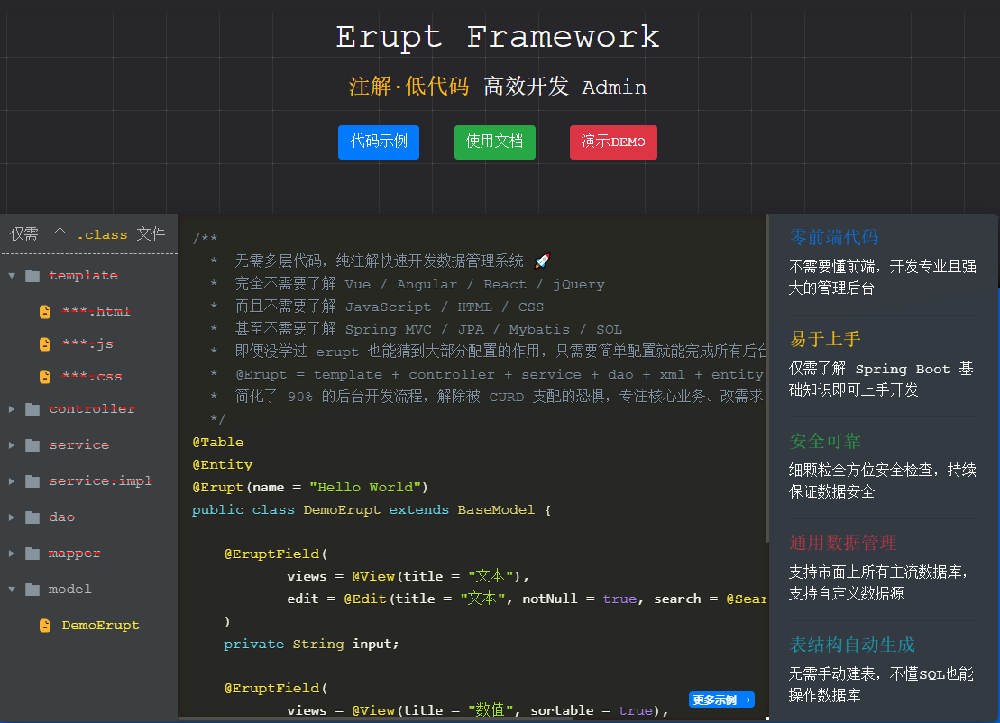

# 若依

http://www.ruoyi.vip/

## [ruoyi-vue-pro](https://github.com/YunaiV/ruoyi-vue-pro)

芋道源码 出品
🔥 官方推荐 🔥 RuoYi-Vue 全新 Pro 版本，优化重构所有功能。基于 Spring Boot + MyBatis Plus + Vue & Element 实现的后台管理系统 + 微信小程序，支持 RBAC 动态权限、数据权限、SaaS 多租户、Activiti + Flowable 工作流、三方登录、支付、短信、商城等功能。


## 工作流 flowable

https://gitee.com/KonBAI-Q/ruoyi-flowable-plus

文档：http://konbai-q.gitee.io/ruoyi-flowable-plus-vuepress/


## 工作流 **[Activiti](https://gitee.com/sgs98/RuoYi-Vue-Plus-Activiti)**

https://gitee.com/sgs98/RuoYi-Vue-Plus-Activiti


# [Erupt Framework](https://www.erupt.xyz/#!/)




# [JimuReport - 积木报表（一款免费Web报表工具）](https://gitee.com/jeecg/JimuReport)

一款免费的数据可视化报表，含报表和大屏设计，像搭建积木一样在线设计报表！功能涵盖，数据报表、打印设计、图表报表、大屏设计等！

- Web 版报表设计器，类似于excel操作风格，通过拖拽完成报表设计。
- 秉承“简单、易用、专业”的产品理念，极大的降低报表开发难度、缩短开发周期、节省成本、解决各类报表难题。
- 领先的企业级Web报表软件，采用纯Web在线技术，专注于解决企业报表快速制作难题。

```
专注于开源，打造“专业 易用 智能 低代码”的数据可视化工具
开源协议：`功能永久免费、可以商用、代码不开放（大屏设计暂时不提供离线版本）`
```

