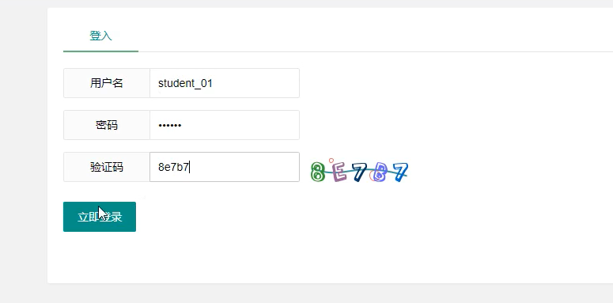
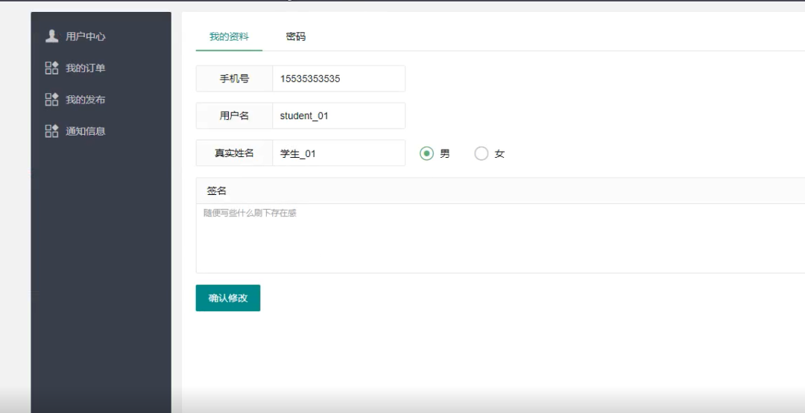
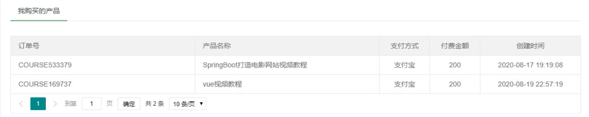

链接：https://pan.baidu.com/s/1_88RU0ikLgkXNk_ltYy2Sw 提取码：8d3n

数据库：链接：https://pan.baidu.com/s/1hn3vmR_zFqwSZIFKGtKfrw 提取码：vk1v

## 1. 技术介绍

核心技术：SpringBoot+mybatis;

前端：layui；

开发工具：idea；

数据库：mysql5.7；

模版引擎：thymeleaf；

安全框架：SpringSecurity；

日志框架：logback；

数据库连接池：druid；

在线编辑器：ckeditor；

图片轮播组件：jQuerySwipeslider；

## 2.功能介绍

本项目分前台用户界面功能和后台管理功能；

前台用户界面功能：

- 滚动大条幅展示重要通知和课程或者活动；
- 展示课程，根据实际业务需求，展示课程推荐，最新课程，免费课程，实战课程；
- 课程搜索，用户输入指定课程关键字，可以搜索查询，也可以根据课程类别分类，和类型进行搜索；
- 课程详细展示
- 用户登陆
- 在线支付

后台管理功能：

- 管理员登录
- 课程管理
- 课程类别管理
- 用户管理
- 授课老师管理
- 订单管理
- 菜单管理
- 友情链接管理
- 系统属性管理
- 自定义帖子管理
- 轮转图片帖子管理

## 3. 前端

### 3.1 首页

### 3.2 课程

提供按照课程的类别，类型以及搜索框进行快速查询相关课程

点击任意一门课程，免费课程可以直接观看，vip课程则需要通过支付宝或者微信缴费开通vip进行观看

### 3.3 登入

学习课程时候需要登录才能观看相关视频资料

登入后可以查看个人中心的相关功能

在我的订单界面可以查看已经购买的课程

### 3.4 商品兑换

### 3.5 课程发布

在课程发布页面可以提交发布的课程资料

在我的发布页面可以查看所有已经发布的课程相关信息，查看审核状态

## 4. 后端

### 4.1 登录

### 4.2 系统管理

包括用户管理，角色管理，菜单管理，可以查看对应的信息并添加，导入，修改或删除

角色管理界面可以为角色分配权限

### 4.3 课程管理

可以添加课程，对课程进行分类管理：公共课程，专业课程，免费课程等

在类别管理中可以添加课程的分类信息

在审核功能处可以对上传的视频进行审核

### 4.4 教师管理

### 4.5 导航菜单

### 4.6 轮播管理

### 4.7 通知管理

### 4.8 礼品管理

